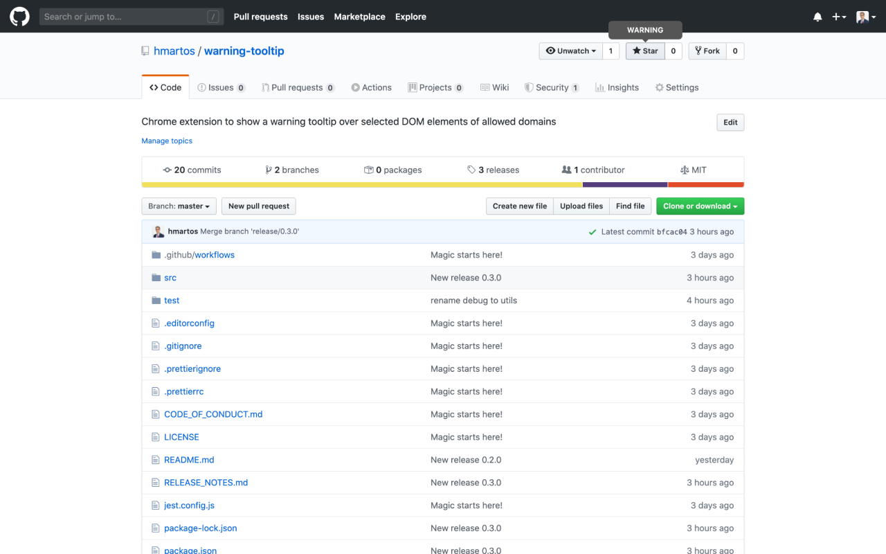
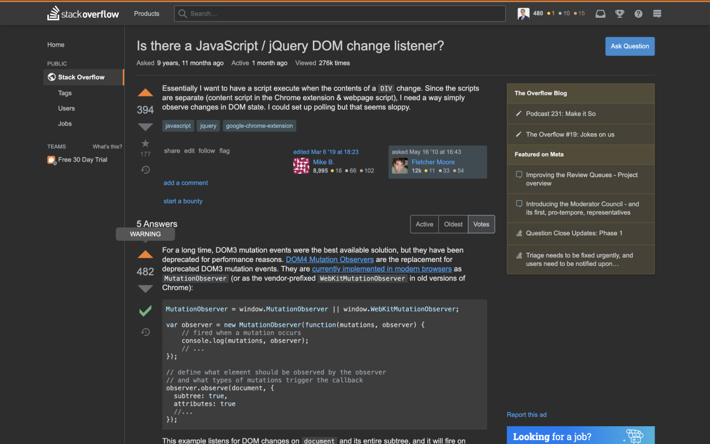

  

  <h1 align="center">Warning Tooltip</h1>

  <h4 align="center">Shows a tooltip with a warning over selected DOM elements of allowed domains</h4>

  
  

This Chrome extension allows you to show a warning tooltip over specific DOM elements selected with a querySelector. This can be useful to warn a developer of the interaction with a production site, and avoid making undesired or destructive actions on live systems.

## Requirements

- [Git](https://git-scm.com/)
- [NodeJS](https://nodejs.org/)

## Getting Started

1. Clone the repository `git clone https://github.com/hmartos/warning-tooltip.git`.
2. Open Google Chrome Extension Management page navigating to [chrome://extensions](chrome://extensions).
   The Extension Management page can also be opened by clicking on the Chrome menu, hovering over `More Tools` then selecting `Extensions`.
3. Enable `Developer Mode` by clicking the toggle switch next to Developer mode in the top right corner.
4. Click the `Load Unpacked` button and select the folder `src` inside the cloned repository.

## Running Tests

Execute `npm test` to run unit tests.

## Build

You can generate a zip file with the extension ready to be uploaded to [Google Chrome Developer Dashboard](https://chrome.google.com/webstore/devconsole)

Just execute `npm run build` and a zip called `warning-tooltip.zip` will be generated.

## License

Copyright 2020 Héctor Martos. Code released under the [MIT License](./LICENSE).
